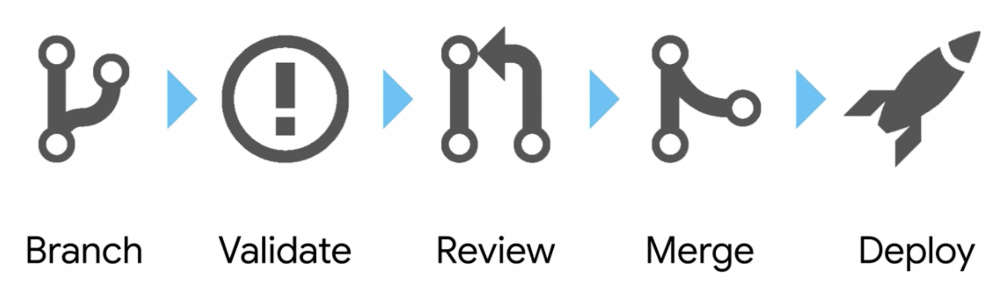

# CONTRIBUTING

Standard CICD / Git Common Workflow for Updating Repository

## Local Development Testing

1. Create Issue via Github, and if owning change - Update Owner and Label Metadata - [Managing labels](https://docs.github.com/en/github/managing-your-work-on-github/managing-labels)

1. Create Git Branch on Local Machine:
 `git checkout -b <branch-name>`
    > TIP: branch names should be prefixed with either `feat`, `bug` or `task` label, issue number and meaningful branch name to simplify tracking, i.e., `[feat|bug|task}-{issue-num}-{branch-name}`. For Example: `feat-101-traefik`,`bug-102-failed_regex`,`task-103-newroute`

1. Make Code Updates and Frequently Commit changes
 `git add .`
 `git commit -am "fix: commit message"`

### Push Local Changes to Remote Repository

Now that you've completed your local development and testing, push up changes remotely and initiate a Pull Request from Feature Branch so that your code can be approved and merged into the main/main branch.

1. Push up changes to remote repository
`git push origin --set-upstream <branch-name>`

1. Pull Down Latest and Greatest from Main Branch to Resolve Trivial/Non-Trivial Conflicts
 `git pull origin main --rebase`

1. Initiate a Pull Request from Github Remote URL by clicking on `Compare & Pull Request` option. - <https://github.com/nutanixservices/cookiecutter-iac-devworkstation>

1. Upon Code Review from Peer - `Merge Pull Request` and `Delete Feature Branch`.