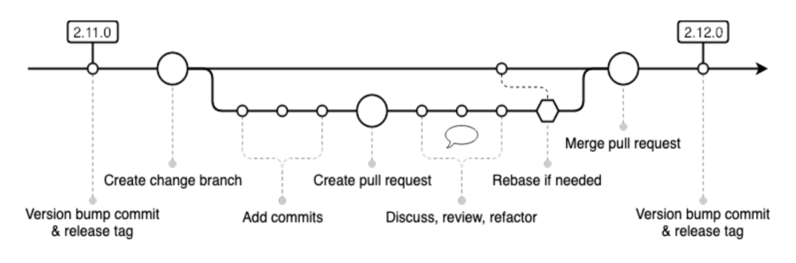

# VWGroup ECHo-automation-iaas - Repository for Nutanix Self-Service (formerly CALM) blueprints


## PreRequisite Requirements for the Self-Service instance with which DSL will interact.
- <span style="color:red;">NOTE - </span> The following links are part of the Nutanix Portal, i.e., [Nutanix Portal](https://portal.nutanix.com/page/login)

1. **Build the Nutanix Self-Service** standalone VMs with scale-out.  [Nutanix Self-Service VM on AHV Document](https://portal.nutanix.com/page/documents/details?targetId=Self-Service-Admin-Operations-Guide-v3_7_1_1:nuc-app-mgmt-vm-deploy-ahv-t.html) - [Nutanix Self-Service VM on AHV Scale-Out Document](https://portal.nutanix.com/page/documents/details?targetId=Self-Service-Admin-Operations-Guide-v3_7_1_1:nuc-app-mgmt-standalone-scaleout-setup-t.html)
2. **Configure** a Nutanix AHV **account** in Self-Service.  [Nutanix Self-Service Account Configuration](https://portal.nutanix.com/page/documents/details?targetId=Self-Service-Admin-Operations-Guide-v3_7_1_1:nuc-app-mgmt-ahv-account-config-c.html)
3. **Create** a **Self-Service project** which utilizes the AHV account above and has a default environment configured for Windows and Linux.  [Nutanix Project Overview](https://portal.nutanix.com/page/documents/details?targetId=Prism-Central-Admin-Center-Guide:ssp-app-mgmt-project-env-c.html)
4. **Create** a **PrismCentral Category** to be used for the backup policy in HYCU.  The key/value pair should be `{"BackupECHO_IAAS": "Standard"}`

## PreRequisite Requirements for the IAC Workstation

- Install code editor software such as [Microsoft VSCode](https://code.visualstudio.com/download), [Notepad++](https://notepad-plus-plus.org/), etc...
  - <span style="color:red;">NOTE - </span>  [Microsoft VSCode](https://code.visualstudio.com/download) is not required for development is this repository but is highly recommended.


##### PreReqs for Mac

- Install [brew](https://docs.brew.sh/Installation).
- Install python3 using `brew install python3`.  Ensure [pip](https://pip.pypa.io/en/stable/installation/) is installed as well by running `pip --version`.
  - Install `virtualenv` via pip, i.e., `pip install virtualenv`.
- Install `openssl` via brew, i.e., `brew install openssl re2`.
  - Add `LDFLAGS` variable, i.e., `LDFLAGS="-L$(/opt/homebrew/bin/brew --prefix openssl)/lib -L$(/opt/homebrew/bin/brew --prefix re2)/lib"      CPPFLAGS="-I$(/opt/homebrew/bin/brew --prefix openssl)/include -I$(/opt/homebrew/bin/brew --prefix re2)/include" GRPC_BUILD_WITH_BORING_SSL_ASM="" GRPC_PYTHON_BUILD_SYSTEM_RE2=true GRPC_PYTHON_BUILD_SYSTEM_OPENSSL=true GRPC_PYTHON_BUILD_SYSTEM_ZLIB=true pip install grpcio`
- Install [make](https://www.gnu.org/software/make/) using `brew install make`.
- Install [Git](https://git-scm.com/download/mac) using `brew install git`.

##### PreReqs for Windows 10

- Install Python for Windows: Download is located here [Python](https://www.python.org/downloads/windows)
  - Python 3.9.7 or above is recommended.  Run the installer. On the first window, make sure to select to have Python added to the PATH.  Verify [pip](https://pip.pypa.io/en/stable/installation/) was installed as well by running `pip -version` from the GitBash terminal; FYI - pip is included with Python 3.9.7.
  - Make a copy of `C:\Program Files\Python3x\python.exe` and name as `python3.exe`.
  - Install `virtualenv` via pip, i.e., `pip install virtualenv`.
    - <span style="color:red;">NOTE: </span> When the installation is complete, update the system `PATH` variable in Windows pointing to `%APPDATA%\Python\Python3x\Scripts` where the version of Python is located instaed of `Python3x`.
- Install [OpenSSL](http://slproweb.com/products/Win32OpenSSL.html), this will be needed for the `scrypt` package. Select the `Win64 OpenSSL v3.x.x` option and run the installer.
- Install [Git/GitBash](https://git-scm.com/download/win).  Select the `64-bit Git for Windows Setup` option.  Run the installer.
  - Optionally, install [PoshGit](https://github.com/dahlbyk/posh-git) which will show you git information, e.g., current branch, etc., at the command prompt.
- Install [Gnu/Make](http://gnuwin32.sourceforge.net/packages/make.htm).  Select the `Complete package, except sources` link.  Once downloaded, run the instller as administrator.
  - <span style="color:red;">NOTE: </span> When the installation is complete, update the system environment variable "Path" pointing to `make.exe`, found in `C:\Program Files (x86)\GnuWin32\bin`.  Also you can copy the 3 files from the GNU bin folder to the GitBash `C:\Program Files\Git\usr\bin` directory to make sure bash can run `make.exe`.
- Download the Visual C++ Redistributable for Visual Studio 2015 installer i.e., vc_redist.x64.exe, currently located here - [Microsoft Visual C++ Redistributable for Visual Studio 2015](https://www.microsoft.com/en-US/Download/confirmation.aspx?id=48145).  Run the downloaded installer.
  - These libraries are needed for some CALM-DSL Python pre-requisites to work on Windows.

### Repository Developer Workflow
1. Clone this repo to your local workstation.
   `git clone https://***/`.
2. To start the DSL virtual environment from your locally cloned git repo, open VSCode in your local repo folder; location from above step.  Then run `make init-calm-config`.  This will install Calm DSL (if not already present) by running `make install-dsl`, It will clone the Calm-DSL source repository, i.e., `https://github.com/nutanix/calm-dsl.git`, and configure DSL for your OS platform, i.e., Windows or MAC/Linux, using Python virtual environments.  In addition, it will create a .local config folder (at the root of your local repo if not present), then run `make schema-input` utilizing a Pyhton schema file which will ask your questions about various variable values to be used in the Calm Environment, i.e., calm project name, prism central (pc) ip, pc username, pc password, as well as blueprint specific items.
  - <span style="color:red;">NOTE > </span>: This is important as it will setup local files that will be referenced using the repo Make workflow.  The Make variable `CALM_ENVIRONMENT` is used  to determine to which Calm instance you will connect (default value is `bwe`).  You can add another Calm instance to the environment by overridding the value by running, e.g., `make init-calm-config CALM_ENVIRONMENT=nyc`, then a folder will be created in the root of your copy of the repo, i.e., `.local/nyc`, which is included in the .gitignore and will not be pushed to the remote GitHub repository.
  - A snippet of what you will be asked is below.
  ```bash
  $ make init-calm-config
    Asking for information about the Calm-DSL installation, Calm instance to utilize and other blueprint specific items
    Starting to configure the repository schema.  Please answer the following questions:
    NOTE - If a default value is present at the end of the question, press "Enter" to select it.  Otherwise, enter a value.
    These questions concern the CALM_CONFIG section of the Schema.
    What is the Nutanix Self-Service IP Address to be used within the repository? [127.0.0.1]:
    What is the Nutanix Self-Service Username used for authentication to be used within the repository? [user@company.com]:
    What is the Nutanix Self-Service Username Password used for authentication to be used within the repository?: password
    What is the Nutanix Self-Service Pre-Configured Project name to be used within the repository? [default]:
  ```
It will then initialize Calm-DSL to the Calm instance by running `make init-dsl-config`.  This will use the .local files, created above, in order to authenticate to PC/Calm against the project you entered in the last step.
1. Create a new feature branch to work on.
   We recommend using the [GitHub GUI](https://docs.github.com/en/pull-requests/collaborating-with-pull-requests/proposing-changes-to-your-work-with-pull-requests/creating-and-deleting-branches-within-your-repository) to create your feature branch so that you don't forget to push your local feature branch to the origin remote.  If you create your feature branch locally, ensure you are currently on the master branch.  Run `git branch <new-branch-name>` then checkout the new branch `git checkout <new-branch-name>`.  Make sure to push it to origin/master by running `git push -u origin <new-branch-name>`.

**Git Common-Flow Specification (Common-Flow)**
While there are no official contributing guidelines documented for this project, we have tried to follow the basic workflow and principles of the Git Common-Flow Specification as documented here: https://commonflow.org  This flow has been widely accepted in most development communities and leverages many of the fundamental best practices of GitHub workflows common used in open-source projects - for both forked and feature branch workflows.

To summarize the key points below:
- The "master" branch is the mainline branch with latest changes, and must not be broken.
- Changes (features, bugfixes, etc.) are done on "feature branches" created from the master branch.
- Rebase change branches early and often.
- When a change branch is stable and ready, it is merged back in to master.
- A release is just a git tag who's name is the exact release version string (e.g. "2.11.4").
- Release branches can be used to avoid change freezes on master. They are not required, instead they are available if you need them.
- A helpful link is here [Feature Branch Update](https://gist.github.com/whoisryosuke/36b3b41e738394170b9a7c230665e6b9)

## Nutanix CALM-DSL Engine Overivew
The Calm DSL (Domain Specific Language) Engine describes a simple Python 3 based DSL for writing Self-Service blueprints, projects, environments, etc.  There is an article [here](https://www.nutanix.dev/2020/03/30/nutanix-calm-dsl-creating-custom-blueprint/) which describes Self-Service blueprints and how each class works; it's a good read and should only take 20-30 minutes but you'll have a better understanding when working with bp, prj, env, etc., python files in CALM-DSL.

## Nutanix CALM-DSL Blueprint Classes Overview


**Makefile Usage Overview**
While the calm dsl engine is used heavily to wrap many of the calm api calls, building and deployment is handled via GNU Make.
[GNU Make](https://www.gnu.org/software/make/) is a tool which controls the generation of executables and other non-source files of a program from the program's source files.
> Make is not limited to building a package. You can also use Make to control installing or deinstalling a package, generate tags tables for it, or anything else you want to do often enough to make it worth while writing down how to do it.
*Make Rules and Targets*
A rule in the makefile tells Make how to execute a series of commands in order to build a target file from source files. It also specifies a list of dependencies of the target file. This list should include all files (whether source files or other targets) which are used as inputs to the commands in the rule.
Here is what a simple rule looks like:
```
target:   dependencies ...
          commands
          ...
```
When you run Make, you can specify particular targets to update; otherwise, Make updates the first target listed in the makefile. Of course, any other target files needed as input for generating these targets must be updated first.
Make uses the makefile to figure out which target files ought to be brought up to date, and then determines which of them actually need to be updated. If a target file is newer than all of its dependencies, then it is already up to date, and it does not need to be regenerated. The other target files do need to be updated, but in the right order: each target file must be regenerated before it is used in regenerating other targets.
*Usage:*
- Run `make help` to review the actual targets and various options that can be executed via make commands in the repo.